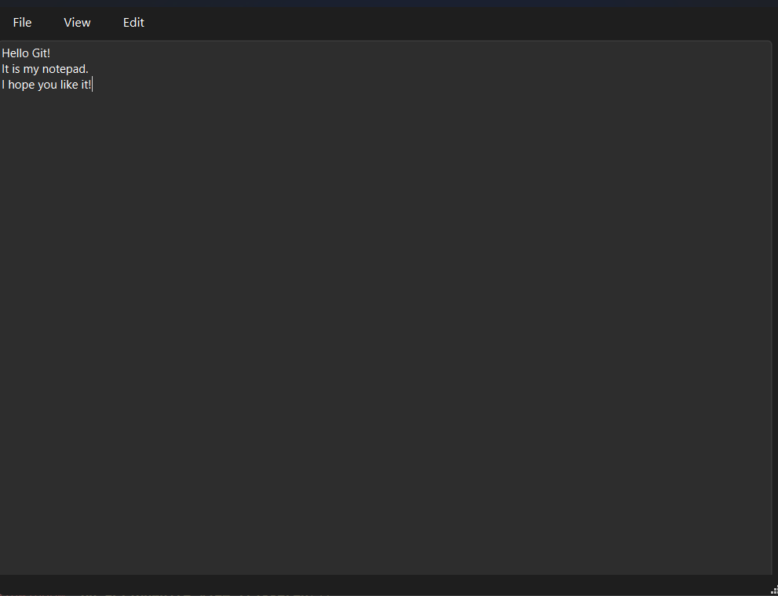

# Notepad 📝 (Qt C++)

A simple text editor built with **Qt** and **C++**. It supports basic functionality like creating, opening, saving files, and switching between light and dark themes.

## 🛠 Features

- Create new files
- Open existing files
- Save text to a file
- Light and dark UI themes
- About dialog

## 🖼️ Interface



## 🔧 Build Instructions

This project requires **Qt 5** or **Qt 6** and **Qt Creator** to build and run.

### Steps:

1. Clone the repository:
   ```bash
   git clone https://github.com/IceSun39/Notepad.git
   cd Notepad
2. Open Notepad.pro in Qt Creator.
3. Click Run or build manually:
  ```bash
  qmake
  make
  ```

# License

This project is intended for educational use. No specific license applies, but you are free to use and modify it with credit to the author.

# 👤 Author

IceSun39 (Vlad Kolesnyk)
